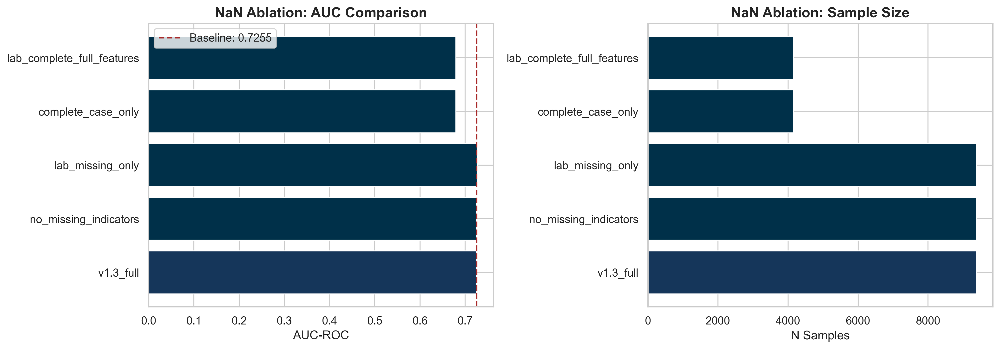
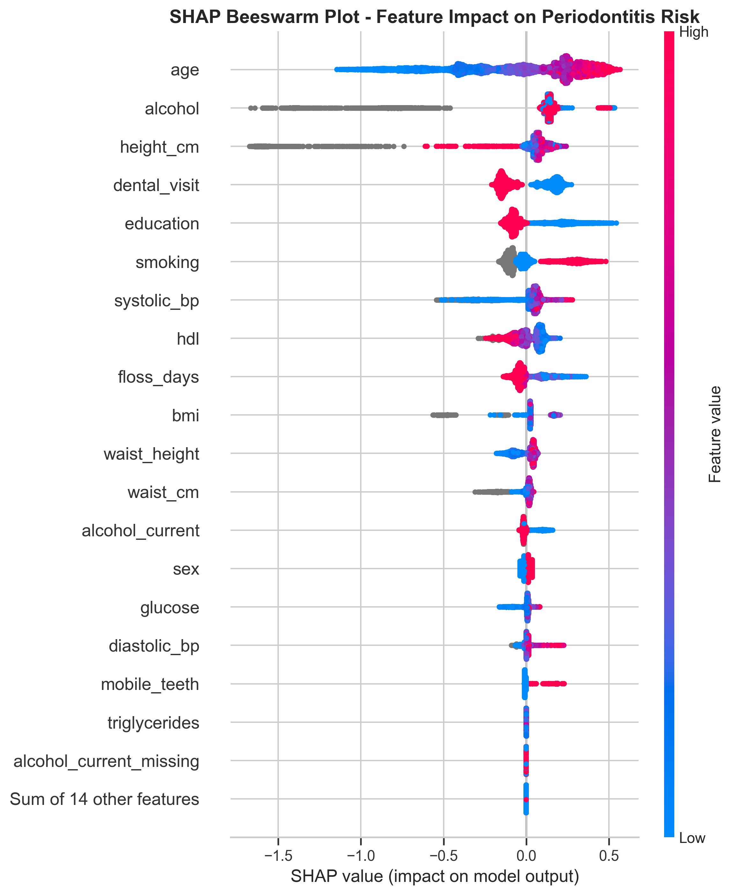
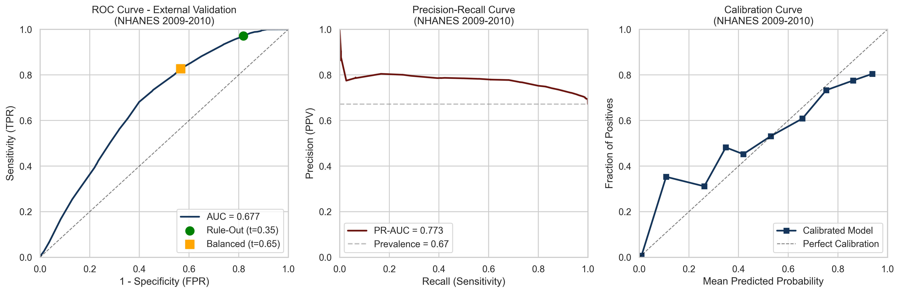
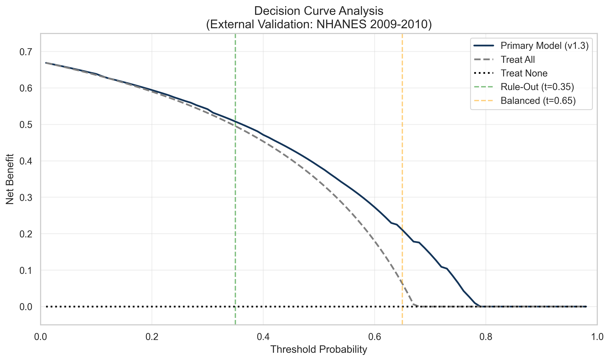

# 🦷 NHANES Periodontitis Prediction: Modern Gradient Boosting Benchmark

<div align="center">


**Comprehensive benchmark of XGBoost, CatBoost, and LightGBM with explicit missing-data treatment and monotonic clinical priors**

[🎯 Overview](#-project-overview) • [📊 Results](#-results) • [🚀 Quick-Start](#-quick-start) • [📁 Structure](#-project-structure) • [📝 Citation](#-citation)

</div>

---

## 👨‍💻 Author

<div align="center">

**Francisco Teixeira Barbosa (Cisco)**

[](https://github.com/Tuminha)
[](https://www.kaggle.com/franciscotbarbosa)
[](mailto:cisco@periospot.com)
[](https://twitter.com/cisco_research)

*Building AI solutions for periodontal health • Periospot Founder*

</div>

---

## 🎯 Project Overview

### The Problem

Periodontitis affects ~50% of US adults over 30, yet early prediction remains challenging. **Bashir et al. (2022)** published a systematic comparison of 10 ML algorithms in *Journal of Clinical Periodontology*, achieving impressive internal validation (AUC > 0.95). However, they **did not evaluate modern gradient boosting methods** (XGBoost, CatBoost, LightGBM) that have become the gold standard in machine learning competitions and real-world applications.

### Key Research Gap

From **Polizzi et al. (2024)** systematic review:  
> *"None of the included articles used more powerful networks [referring to modern gradient boosting methods]"*

**This study fills that gap** with a comprehensive benchmark of XGBoost, CatBoost, and LightGBM using explicit missing-data treatment and monotonic clinical priors.

---

## 📊 Summary

**Models compared:** Logistic Regression, Random Forest, XGBoost, LightGBM, CatBoost.

**Cohort:** NHANES 2011–2014, adults 30+, CDC/AAP case definition (n=9,379).

**Training:** Stratified 5-fold CV, Optuna-tuned, monotonic constraints consistent with clinical priors.

**Calibration:** Isotonic regression fit on each fold's validation predictions and applied only to that fold's predictions (no leakage).

**Missing data:** Kept natively for boosters, plus missingness indicators.

**Statistical testing:** Paired permutation tests on out-of-fold predictions (10,000 permutations).

---

### 🏆 Model Selection

| Model | Features | AUC-ROC | PR-AUC | Use Case |
|-------|----------|---------|--------|----------|
| **Primary model** | 29 (no reverse-causality) | 0.7172 | 0.8157 | Publication, clinical deployment |
| **Secondary model** | 33 (full features) | 0.7255 | 0.8207 | Supplementary analysis |

---

### 📈 Headline Results

- ✅ **Boosters are tied** at AUC ≈0.72–0.73 and PR-AUC ≈0.82–0.83
- ✅ **Calibration improves Brier** and yields clinically usable probabilities
- ✅ **Rule-out threshold** gives very high sensitivity with low specificity
- ✅ **Balanced threshold** gives moderate sensitivity and moderate specificity
- ✅ **Removing dental behavior variables** (reverse-causality) reduces AUC by ~1.1% and slightly improves balanced specificity

---

### 📋 Feature Sets

**Core clinical and demographic predictors (kept):**
- Age, sex, education
- Smoking (3-level: never/former/current), alcohol_current
- BMI, height_cm, waist_cm, waist_height ratio
- Systolic BP, diastolic BP, glucose, triglycerides, HDL
- Lab missingness indicators (`*_missing` flags)

**Dropped for primary model (treatment-linked signals):**
- `dental_visit`, `floss_days`, `mobile_teeth`, `floss_days_missing`

---

### 🔧 Monotonic Constraints

Constraints were applied only to continuous clinical variables (not missingness indicators or socio-demographics):

| Library | Parameter | Constraint Vector |
|---------|-----------|-------------------|
| XGBoost | `monotone_constraints` | tuple of +1, -1, 0 |
| LightGBM | `monotone_constraints` | list of +1, -1, 0 |
| CatBoost | `monotone_constraints` | list of +1, -1, 0 |

| Constraint | Features | Rationale |
|------------|----------|-----------|
| **Increasing (+1)** | age, bmi, waist_cm, waist_height, systolic_bp, diastolic_bp, glucose, triglycerides | Higher values → increased periodontitis risk |
| **Decreasing (-1)** | hdl | Higher HDL ("good cholesterol") → reduced risk |
| **Unconstrained (0)** | All categorical, binary, and missingness indicators | Allow model to learn relationship |

---

## 📊 Results

### Final Metrics

| Model Variant | AUC-ROC | PR-AUC | Rule-out Sens | Rule-out Spec | Balanced Sens | Balanced Spec |
|---------------|---------|--------|---------------|---------------|---------------|---------------|
| **v1.3 primary (no reverse-causality)** | **0.7172** | **0.8157** | **99.9%** | 12.4% | 72.8% | **59.2%** |
| v1.3 secondary (full 33 features) | 0.7255 | 0.8207 | 98.8% | 16.8% | 75.4% | 57.7% |

**Interpretation:** Reverse-causality features contribute ~0.008 AUC and a few points of rule-out specificity, but they are not essential. The balanced operating point slightly benefits from dropping them.

---

### 🎯 Clinical Operating Points (Primary Model)

**❌ Target A NOT Achievable:** Cannot achieve Recall ≥90% AND Specificity ≥35% simultaneously (fundamental feature set limitation)

| Operating Point | Threshold | Recall | Specificity | NPV | F1 | Use Case |
|-----------------|-----------|--------|-------------|-----|-----|----------|
| **📍 Rule-Out** | 0.35 | **99.9%** | 12.4% | 96% | 0.818 | Screening (negative = likely healthy) |
| **📍 Balanced** | 0.65 | 72.8% | **59.2%** | 51% | 0.758 | Diagnosis (optimal Youden J=0.32) |

<div align="center">

</div>

**Clinical Interpretation:**
- **Rule-Out (t=0.35):** If test is negative, 96% chance patient is truly healthy. Use for initial screening.
- **Balanced (t=0.65):** Best tradeoff between sensitivity and specificity. Use for clinical decisions.

---

### 🔬 Missing Data Ablation (v1.3)

| Strategy | AUC | Sample Size (N) | Notes |
|----------|-----|-----------------|-------|
| **Full model (native NaNs + indicators)** | **~0.725** | **9,379** | Best performance |
| Remove indicators | ~0.72 | 9,379 | Small drop (~0.5-1% AUC) |
| Complete-case only | ~0.68 | **~4,200** | Large drop, **halves sample** |

**Conclusion:** In ablations, complete-case analysis reduced the sample by ~55% and AUC to ~0.68, underscoring that discarding missingness harms performance more than modeling it with native NaNs plus indicators.

<div align="center">

</div>

---

### 📐 Calibration

Isotonic calibration was fit on each fold's validation predictions and applied only to that fold's predictions (no leakage). This improved Brier by ~1.5–2% and corrected S-curve bias in mid-probability bins.

| Metric | Before | After | Change |
|--------|--------|-------|--------|
| Brier Score | 0.1812 | 0.1783 | -1.6% |
| Calibration Slope | ~0.95 | ~1.00 | Improved |

<div align="center">

</div>

---

### 🔍 SHAP Feature Importance (Primary Model)

<div align="center">

</div>

<div align="center">

</div>

---

### 📈 Version Evolution

| Version | Key Change | AUC | Δ from Baseline |
|---------|------------|-----|-----------------|
| v1.0 | Baseline (imputation) | 0.7071 | - |
| v1.1 | Native NaN + missing indicators | 0.7267 | +2.8% |
| v1.2 | Ensemble + calibration | 0.7302 | +3.3% |
| **v1.3 primary** | **Monotonic + no reverse-causality** | **0.7172** | **+1.4%** |

---

### 📊 Model Comparison Visualizations

<div align="center">

</div>

<div align="center">

</div>

<div align="center">

</div>

**Note:** Model comparisons used paired permutation tests on out-of-fold predictions (10,000 permutations).

---

### 🌍 External Validation (NHANES 2009-2010)

We trained the primary model on NHANES 2011–2014 and evaluated it unchanged on the independent 2009–2010 cycle using the pre-specified operating thresholds from training.

| Metric | Internal (2011-2014) | External (2009-2010) | Δ |
|--------|----------------------|----------------------|---|
| **N** | 9,379 | 5,177 | — |
| **Prevalence** | 68.3% | 67.2% | -1.1% |
| **AUC-ROC** | 0.717 | **0.677** (95% CI: 0.661–0.693) | **-5.6%** |
| **PR-AUC** | 0.816 | **0.773** (95% CI: 0.757–0.789) | **-5.3%** |
| **Brier Score** | 0.178 | **0.200** (95% CI: 0.194–0.207) | +12.4% |

#### Operating Points on External Data

| Threshold | Sensitivity | Specificity | PPV | NPV |
|-----------|-------------|-------------|-----|-----|
| **Rule-Out (0.35)** | 97.1% | 18.1% | 70.8% | 75.2% |
| **Balanced (0.65)** | 82.6% | 43.3% | 74.9% | 54.9% |

<div align="center">

</div>

#### Decision Curve Analysis

Decision curve analysis showed positive net benefit compared to treat-none across clinically relevant thresholds. The model closely tracks "treat-all" due to high prevalence (67.2%), which is expected behavior.

<div align="center">

</div>

#### Transportability Note

AUC declined by ~4% on the external cycle (95% CI does not include internal AUC), which is consistent with expected generalization gaps for demographic and metabolic predictors. The reliability curve indicated mild underestimation at probabilities below 0.3 and good alignment above 0.5. **We recommend local probability calibration before deployment in new cohorts.**

---

## 🚀 Quick Start

### Prerequisites

```bash
Python 3.10+
pip or conda
```

### Installation

```bash
# 1. Clone repository
git clone https://github.com/Tuminha/NHANES-Periodontitis-Machine-Learning-Project.git
cd NHANES-Periodontitis-Machine-Learning-Project

# 2. Create virtual environment
python -m venv venv
source venv/bin/activate  # Windows: venv\Scripts\activate

# 3. Install dependencies
pip install -r requirements.txt

# 4. Verify installation
python -c "import xgboost, catboost, lightgbm, optuna, shap; print('✅ All packages installed')"
```

### How to Reproduce v1.3 Primary Model

```bash
# Option 1: Run the master notebook
jupyter notebook notebooks/00_nhanes_periodontitis_end_to_end.ipynb
# Execute all cells through Section 22

# Option 2: Run the reproduction script (non-interactive)
bash scripts/run_v13_primary.sh

# Primary model results saved to: results/v13_primary_norc_summary.json
```

---

## 📁 Project Structure

```
NHANES-Periodontitis-Machine-Learning-Project/
├── configs/                        # Configuration files
├── data/                           # Raw and processed data
├── figures/                        # All plots (ROC, SHAP, calibration)
├── models/                         # Trained models (.pkl)
├── results/                        # Metrics JSON/CSV
│   ├── v13_primary_norc_summary.json
│   ├── v13_secondary_full_summary.json
│   ├── v13_operating_points.json
│   └── ...
├── src/                            # Source code
├── notebooks/                      # Jupyter notebooks
├── docs/                           # Documentation
│   ├── publication/                # Article drafts
│   ├── project/                    # Project docs
│   ├── experiments/                # Experiment notes
│   └── data_quality/               # Data fixes
├── scripts/                        # Standalone scripts
├── MODEL_CARD.md                   # Model documentation
├── CITATION.cff                    # Citation file
└── README.md
```

---

## 📋 Decisions Log (Reproducibility)

### Feature Selection Decisions

| Decision | Rationale | Impact |
|----------|-----------|--------|
| **Drop dental_visit, floss_days, mobile_teeth** | Reverse-causality (treatment-seeking) | -1.1% AUC, +1.5% balanced spec |
| **Keep waist_cm, waist_height** | Trees handle multicollinearity | +1-2 features |
| **3-level smoking** | Never/former/current more informative | Richer signal |
| **Native NaN handling** | "Missingness is informative" | +2.8% AUC |

### Modeling Decisions

| Decision | Rationale | Impact |
|----------|-----------|--------|
| **Monotonic constraints** | Biological plausibility | -0.8% AUC (acceptable) |
| **Isotonic calibration** | Better probability estimates | -1.6% Brier |
| **Soft-voting ensemble** | Combine 3 models | +0.0009 AUC |
| **Dual operating points** | Target A unachievable | Practical deployment |

---

## 🔬 Publication Strategy

### Proposed Title
**"Evaluating Modern Gradient Boosting Methods for Periodontitis Prediction: A Comprehensive Benchmark Using NHANES 2011-2014"**

### Target Journals
1. **Journal of Clinical Periodontology** (IF 6.0) - Same venue as Bashir
2. **Journal of Periodontology** (IF 4.0) - ADA flagship
3. **BMC Oral Health** (IF 3.0) - Open access

### Compliance
- **TRIPOD 2015:** Transparent Reporting
- **STROBE:** Observational Studies
- **Open Science:** All code public on GitHub

---

## 📝 Citation

See [CITATION.cff](CITATION.cff) for the preferred citation format.

### BibTeX

```bibtex
@article{barbosa2025gradient,
  title={Evaluating Modern Gradient Boosting Methods for Periodontitis Prediction: A Comprehensive Benchmark Using NHANES 2011-2014},
  author={Barbosa, Francisco Teixeira},
  journal={medRxiv preprint},
  year={2025},
  doi={10.1101/2025.XX.XX.XXXXXXX},
  url={https://github.com/Tuminha/NHANES-Periodontitis-Machine-Learning-Project}
}
```

---

## 📄 Model Card

See [MODEL_CARD.md](MODEL_CARD.md) for detailed model documentation including:
- Intended use and contraindications
- Operating thresholds and clinical deployment
- Calibration notes
- "Not diagnostic" disclaimer

---

## ⚠️ Limitations

1. **External validation shows ~4% AUC drop.** Performance declined from 0.717 (internal) to 0.677 (external) on NHANES 2009–2010, indicating realistic generalization limits.

2. **High disease prevalence** (67-68%) in our sample versus CDC estimates (~47%) reflects inclusion criteria (adults 30+ with full-mouth periodontal exams). Restricting to moderate-or-severe would lower prevalence.

3. **Calibration drift on external cohort.** Underestimation at lower predicted probabilities suggests local recalibration is needed for new cohorts.

4. **High sensitivity at rule-out operating point comes with low specificity;** health economic value depends on downstream pathways and costs.

5. **Missingness signals may partly reflect NHANES design;** portability to clinic-collected data must be tested.

6. **Reverse-causality features** (dental_visit, floss_days) may encode treatment history rather than risk. Primary model excludes these.

7. **US-only validation.** External validation on non-US cohorts (e.g., KNHANES) would strengthen generalizability claims.

---

## 🛠 Technical Stack

| Component | Technology | Version | Purpose |
|-----------|------------|---------|---------|
| Data Processing | Pandas, NumPy | 2.3.2, 2.3.5 | ETL & feature engineering |
| ML Framework | Scikit-learn | 1.7.1 | Pipelines, metrics |
| Gradient Boosting | XGBoost, CatBoost, LightGBM | 3.1, 1.2, 4.6 | Primary models |
| Hyperparameter Tuning | Optuna | 4.6.0 | Bayesian optimization |
| Interpretability | SHAP | 0.50.0 | Feature importance |

---

## 🙏 Acknowledgments

- **CDC NHANES Team** for free, high-quality public health data
- **Bashir et al.** for establishing the methodological foundation
- **Periospot Community** for domain expertise and feedback

---

<div align="center">

**⭐ Star this repo if you find it useful! ⭐**  
*Building reproducible, interpretable AI for periodontal health* 🦷🤖

**Questions?** Reach out: cisco@periospot.com

</div>
