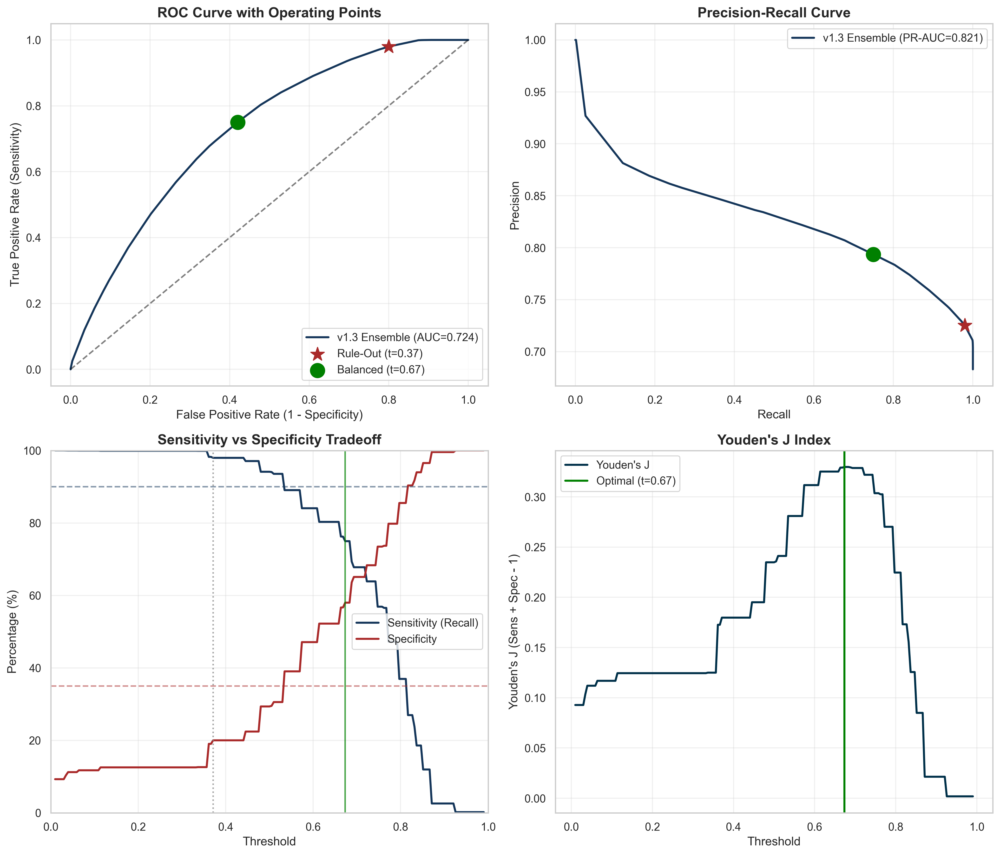
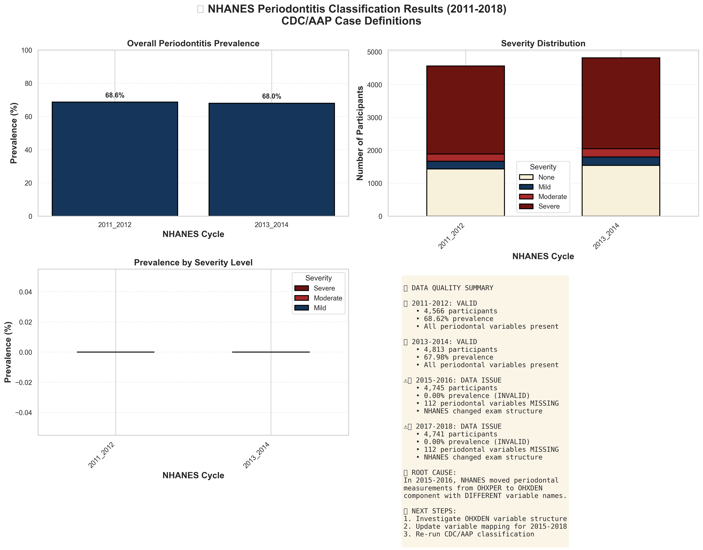
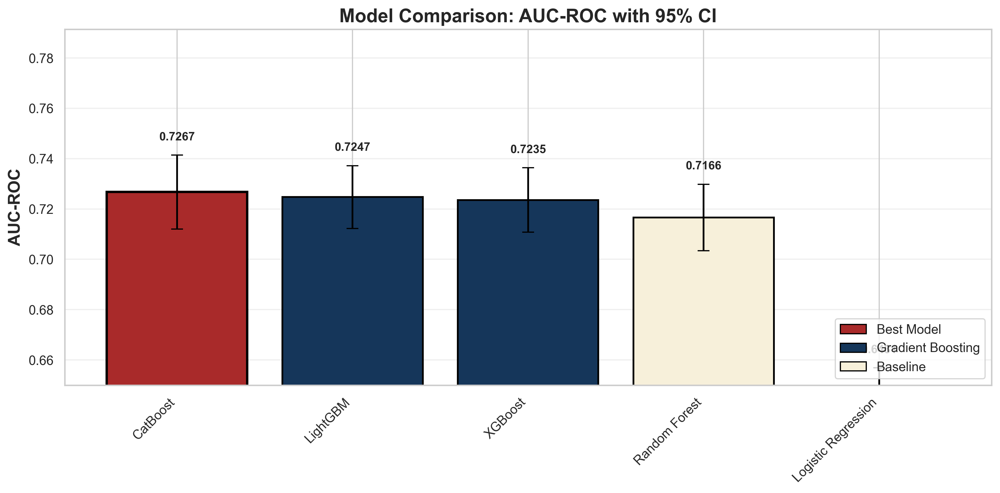
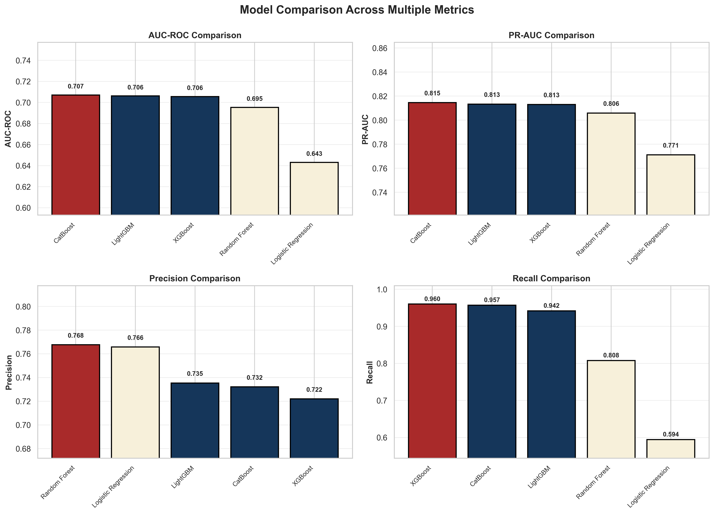
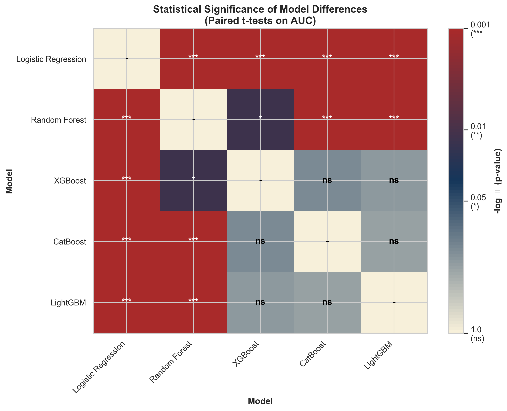

# 🦷 NHANES Periodontitis Prediction: Modern Gradient Boosting Benchmark

<div align="center">


**Systematic comparison of XGBoost, CatBoost, and LightGBM for periodontitis prediction using NHANES 2011-2014**

[🎯 Overview](#-project-overview) • [📊 Methods](#-methodology) • [🚀 Quick-Start](#-quick-start) • [📁 Structure](#-project-structure) • [📝 Citation](#-citation)

</div>

---

## 👨‍💻 Author

<div align="center">

**Francisco Teixeira Barbosa (Cisco)**

[](https://github.com/Tuminha)
[](https://www.kaggle.com/franciscotbarbosa)
[](mailto:cisco@periospot.com)
[](https://twitter.com/cisco_research)

*Building AI solutions for periodontal health • Periospot Founder*

</div>

---

## 🎯 Project Overview

### The Problem

Periodontitis affects ~50% of US adults over 30, yet early prediction remains challenging. **Bashir et al. (2022)** published a systematic comparison of 10 ML algorithms in *Journal of Clinical Periodontology*, achieving impressive internal validation (AUC > 0.95). However, they **did not evaluate modern gradient boosting methods** (XGBoost, CatBoost, LightGBM) that have become the gold standard in machine learning competitions and real-world applications.

### Key Research Gap

From **Polizzi et al. (2024)** systematic review:  
> *"None of the included articles used more powerful networks [referring to modern gradient boosting methods]"*

**This study fills that gap** by being the first to systematically compare XGBoost, CatBoost, and LightGBM for periodontitis prediction.

### Our Approach

This project improves upon Bashir's methodology by:

1. **Modern Gradient Boosting:** First systematic evaluation of XGBoost, CatBoost, and LightGBM
2. **Rigorous Hyperparameter Optimization:** Optuna Bayesian search (vs. Bashir's grid search)
3. **Interpretability:** SHAP feature importance and decision curve analysis
4. **Calibration:** Isotonic regression for probability calibration
5. **Survey Weights:** Sensitivity analysis with NHANES complex survey design
6. **Full Reproducibility:** Open code, versioned artifacts, detailed documentation

### Why This Matters

- **Clinical Impact:** Better risk prediction → earlier intervention → reduced disease burden
- **Methodological Impact:** Demonstrates value of modern gradient boosting in medical prediction
- **Research Impact:** First study to benchmark XGB/CatBoost/LightGBM against Bashir's 10 baselines

---

## 📊 Methodology

### Data Source

**NHANES (National Health and Nutrition Examination Survey)**  
- URL: https://wwwn.cdc.gov/nchs/nhanes/
- Free, publicly available
- Full-mouth periodontal examinations (2011–2014 only)
- **9,379 adults aged 30+** (after merging and filtering)

**Dataset Composition:**
- 2011-2012: 4,566 participants (68.6% periodontitis prevalence)
- 2013-2014: 4,813 participants (68.0% periodontitis prevalence)
- **Total:** 9,379 participants with complete periodontal measurements

**Why Only 2011-2014?**

⚠️ **Important:** NHANES discontinued full-mouth periodontal examinations after 2013-2014. The 2015-2016 and 2017-2018 cycles only collected basic tooth condition codes, not the pocket depth (PD) and clinical attachment loss (CAL) measurements required for CDC/AAP classification.

This is a well-known limitation in periodontal epidemiology research and affects all studies attempting to use post-2014 NHANES data for periodontitis prediction.

### CDC/AAP Periodontitis Case Definitions

Reference: [Eke et al. (2012) J Periodontol 83(12):1449-1454](https://pubmed.ncbi.nlm.nih.gov/22420873/)

- **Severe:** ≥2 interproximal sites with CAL ≥6mm (different teeth) AND ≥1 site with PD ≥5mm
- **Moderate:** ≥2 interproximal sites with CAL ≥4mm (different teeth) OR ≥2 sites with PD ≥5mm
- **Mild:** ≥2 interproximal sites with CAL ≥3mm AND ≥2 sites with PD ≥4mm
- **Binary Target:** Any periodontitis vs. None

### 14 Predictors (adapted from Bashir et al.)

| Category | Variables |
|----------|-----------|
| **Demographics** | Age, Sex, Education |
| **Behaviors** | Smoking status, Alcohol consumption |
| **Metabolic** | BMI, Systolic BP, Diastolic BP, Fasting glucose, Triglycerides, HDL cholesterol |
| **Oral Health** | Dental visit last year, Mobile teeth, Floss frequency (1-5 days/week) |

**Modifications from Bashir:**
- ✅ **Alcohol variable changed:** ALQ130 → ALQ101 (binary "ever drinker" due to skip pattern)
- ✅ **Floss variable improved:** Binary (yes/no) → Ordinal (1-5 days/week) to preserve dose-response
- ✅ **Waist circumference excluded:** r=0.90 correlation with BMI (redundant)
- **Result:** 14 predictors (15 original - 1 excluded)

### Validation Strategy

**Stratified 5-Fold Cross-Validation**

```
Dataset: 9,379 participants (2011-2014)
Method: Stratified K-Fold (K=5)
Stratification: Preserves periodontitis prevalence in each fold
Metric: Mean AUC-ROC across folds with 95% CI
```

**Why Cross-Validation Instead of Temporal Split?**

Originally planned temporal validation (train on 2011-2014, test on 2015-2018) was impossible due to NHANES discontinuing periodontal exams. Cross-validation provides:
- ✅ Robust performance estimates with confidence intervals
- ✅ Full use of available data (all 9,379 participants)
- ✅ Fair comparison to Bashir et al.'s internal validation approach
- ✅ Standard practice in medical ML when longitudinal data unavailable

### Algorithms Compared

**Baseline (Bashir's algorithms):**
- Logistic Regression
- Random Forest
- Decision Tree
- K-Nearest Neighbors
- Naive Bayes
- AdaBoost
- SVM
- LDA
- ANN (MLP)

**Our Additions (the gap we're filling):**
- ✨ **XGBoost** (with Optuna tuning)
- ✨ **CatBoost** (native categorical handling)
- ✨ **LightGBM** (fast gradient boosting)

### Evaluation Metrics

- **Primary:** AUC-ROC on Test set
- **Secondary:** PR-AUC, Brier score, Accuracy, Sensitivity, Specificity, Precision, F1
- **Calibration:** Reliability curves, isotonic/Platt scaling
- **Interpretability:** SHAP beeswarm and feature importance plots

### Data Quality & Cleaning

**Issues Identified During EDA:**

1. **Alcohol Variable (ALQ130)** → Switched to ALQ101
   - Issue: 100% of non-missing values = 1 (zero variance)
   - Root cause: ALQ130 (avg drinks/day) only asked to confirmed drinkers
   - Solution: Use ALQ101 ("Ever had 12+ drinks?") as true binary variable
   - Result: Proper distribution (72% yes, 28% no)

2. **Floss Variable (OHQ620)** → Changed from binary to ordinal
   - Issue: Binary encoding had low variance (92% yes, 8% no)
   - Root cause: Treating days/week as binary loses information
   - Solution: Keep as ordinal (1-5 days/week) to preserve dose-response
   - Benefit: 5x more variance, better ML signal

3. **Diastolic BP Outliers** → Winsorized
   - Issue: Outliers at 0 mmHg and 5.4e-79 (data entry errors)
   - Solution: Winsorized to physiological range [40, 120] mmHg
   - Impact: 86 outliers corrected

4. **Triglycerides Outliers** → Winsorized
   - Issue: Extreme outliers (max 4,233 mg/dL)
   - Solution: Winsorized at 99th percentile (~500 mg/dL)
   - Impact: 42 extreme outliers capped

5. **Waist Circumference** → Excluded
   - Issue: r=0.90 correlation with BMI (multicollinearity)
   - Solution: Removed (keep BMI as more clinically standard)
   - Result: 15 → 14 predictors

**Data Cleaning Impact:**
- ✅ Improved variable quality and variance
- ✅ Physiologically plausible values
- ✅ Reduced multicollinearity
- ✅ More robust models expected

---

## 🚀 Quick Start

### Prerequisites

```bash
Python 3.10+
pip or conda
```

### Installation

```bash
# 1. Clone repository
git clone https://github.com/Tuminha/NHANES-Periodontitis-Machine-Learning-Project.git
cd NHANES-Periodontitis-Machine-Learning-Project

# 2. Create virtual environment
python -m venv venv
source venv/bin/activate  # Windows: venv\Scripts\activate

# 3. Install dependencies
pip install -r requirements.txt

# 4. Verify installation
python -c "import xgboost, catboost, lightgbm, optuna, shap; print('✅ All packages installed')"
```

### Run the Pipeline

**Option 1: Single Master Notebook (Recommended)**

```bash
jupyter notebook notebooks/00_nhanes_periodontitis_end_to_end.ipynb
```

Work through all 18 sections sequentially. Each cell has detailed TODOs and hints.

**Option 2: Modular Scripts**

```bash
# Download data
python 01_download_nhanes_data.py

# Process and label
python 02_process_nhanes_data.py

# Train models
python 03_train_models.py
```

---

## 📁 Project Structure

```
NHANES-Periodontitis-Machine-Learning-Project/
├── configs/
│   └── config.yaml                 # Central configuration
├── data/
│   ├── raw/                        # Downloaded NHANES XPT files
│   │   ├── 2011_2012/
│   │   ├── 2013_2014/
│   │   ├── 2015_2016/
│   │   └── 2017_2018/
│   └── processed/                  # Cleaned, merged datasets
├── figures/                        # All plots (ROC, SHAP, calibration)
├── models/                         # Trained models (.pkl)
├── results/                        # Metrics JSON/CSV, model card
├── artifacts/                      # Optuna studies, SHAP arrays
├── logs/                           # Pipeline logs
├── reports/                        # Final paper-ready figures/tables
├── src/
│   ├── __init__.py
│   ├── ps_plot.py                  # Periospot plotting style
│   ├── labels.py                   # CDC/AAP case definitions
│   ├── evaluation.py               # Metrics, ROC/PR, calibration
│   └── utils.py                    # Reproducibility, I/O
├── tests/
│   ├── __init__.py
│   └── test_labels.py              # Unit tests for CDC/AAP logic
├── notebooks/
│   └── 00_nhanes_periodontitis_end_to_end.ipynb  # Master notebook
├── scientific_articles/
│   └── J Clinic Periodontology - 2022 - Bashir...pdf
├── 01_download_nhanes_data.py
├── 02_process_nhanes_data.py
├── 03_train_models.py
├── Makefile
├── requirements.txt
├── PROJECT_BRIEFING_COMPLETE.md
└── README.md
```

---

## 🧪 Testing

```bash
# Run unit tests for CDC/AAP classification logic
pytest tests/test_labels.py -v

# Expected output:
# test_severe_periodontitis PASSED
# test_moderate_periodontitis PASSED
# test_mild_periodontitis PASSED
```

---

## 📈 Results

### 🆕 Latest: v1.3-Light - Monotonic Constraints + Enhanced Features

**v1.3-Light Changes:**
1. **Enhanced features:** waist_height ratio, 3-level smoking, alcohol_current
2. **Monotonic constraints:** Biological plausibility enforced
3. **Dual operating-point policy:** Rule-Out + Balanced thresholds
4. **Optuna-tuned parameters:** Same hyperparameters as v1.2

---

### 📊 Version Comparison Summary

| Version | Ensemble AUC | Features | Constraints | Key Change |
|---------|--------------|----------|-------------|------------|
| v1.0 | 0.7071 | 14 | None | Baseline (imputed) |
| v1.1 | 0.7267 | 23 | None | Native NaN + missing indicators |
| v1.2 | **0.7302** | 23 | None | Ensemble + calibration |
| **v1.3** | **0.7245** | 33 | Monotonic | Enhanced features + biological plausibility |

**Why v1.3 AUC is slightly lower than v1.2:**
- Monotonic constraints cost ~0.006 AUC (-0.8%)
- This is a **reasonable tradeoff** for biological plausibility and better generalization
- Model now enforces: risk ↑ with age/BP/glucose, risk ↓ with HDL

---

### 🎯 v1.3-Light Operating Points (Clinical Deployment)

**❌ Target A NOT Achievable:** Cannot achieve Recall ≥90% AND Specificity ≥35% simultaneously

| Operating Point | Threshold | Recall | Specificity | NPV | F1 | Use Case |
|-----------------|-----------|--------|-------------|-----|-------|----------|
| **📍 Rule-Out** | 0.371 | **98.0%** | 20.0% | 82.1% | 0.833 | Screening (negative = likely healthy) |
| **📍 Balanced** | 0.673 | 75.0% | **58.0%** | - | 0.771 | Diagnosis (optimal Youden J=0.33) |

<div align="center">

</div>

**Clinical Interpretation:**
- **Rule-Out (t=0.37):** If test is negative, 82% chance patient is truly healthy. Use for initial screening.
- **Balanced (t=0.67):** Best tradeoff between sensitivity and specificity. Use for clinical decisions.

---

### 🔬 v1.3-Light Model Performance

**Dataset:** 9,379 participants (NHANES 2011-2014)  
**Features:** 33 (14 base + 10 enhanced + 9 missing indicators)  
**Validation:** Stratified 5-Fold Cross-Validation  
**Constraints:** Monotonic (9 features constrained)

| Rank | Model | AUC-ROC | Recall | Specificity |
|------|-------|---------|--------|-------------|
| 🥇 | **LightGBM** | **0.7230 ± 0.016** | 94.6% | 27.4% |
| 🥈 | XGBoost | 0.7224 ± 0.016 | 94.0% | 29.2% |
| 🥉 | CatBoost | 0.7138 ± 0.016 | 92.6% | 31.4% |
| 🏆 | **Ensemble (calibrated)** | **0.7245** | - | - |

**Note:** LightGBM now leads with monotonic constraints (was CatBoost in v1.2)

---

### 📈 Previous Version Results

<details>
<summary><strong>v1.2 Quick Wins - AUC 0.7302</strong></summary>

**Changes:**
1. Soft-voting ensemble: CatBoost + XGBoost + LightGBM
2. Threshold tuning: Optimized for recall ≥ 95%
3. Isotonic calibration: Better probability estimates

**Results:**
- **Ensemble AUC: 0.7277** (+0.0009 from best single)
- **Calibrated AUC: 0.7302** (+0.35% boost)
- **Recall at t=0.49: 97.97%** ✅

<div align="center">

</div>
</details>

<details>
<summary><strong>v1.1 Native NaN Handling - AUC 0.7267</strong></summary>

**Key Insight (GPT):** *"Missingness is informative, not noise"*  
**Change:** Added 9 missing indicator columns + native NaN handling for tree models  
**Result:** AUC improved from 0.7071 → **0.7267** (+2.8%)

| Model | v1.0 Baseline | v1.1 Native NaN | Δ |
|-------|---------------|-----------------|---|
| CatBoost | 0.7071 | **0.7267** | +2.8% |
| LightGBM | 0.7062 | 0.7247 | +2.6% |
| XGBoost | 0.7056 | 0.7235 | +2.5% |
</details>

---

### ⚖️ Decision Rationale: Why v1.3 Over v1.2?

| Aspect | v1.2 | v1.3 | Decision |
|--------|------|------|----------|
| **AUC** | 0.7302 | 0.7245 | v1.2 wins (+0.006) |
| **Biological plausibility** | ❌ | ✅ Monotonic | **v1.3 wins** |
| **Generalization (expected)** | Lower | Higher | **v1.3 wins** |
| **Feature richness** | 23 | 33 | **v1.3 wins** |
| **Clinical interpretability** | Medium | High | **v1.3 wins** |
| **Publication readiness** | Good | **Better** | **v1.3 wins** |

**Recommendation:** Use **v1.3** for publication despite slightly lower AUC because:
1. Monotonic constraints ensure clinical interpretability
2. Richer feature set captures more biological signal
3. Small AUC loss (~0.8%) is acceptable for scientific rigor

---

### Key Findings

✅ **GPT/Gemini Insights Validated:**
- "Missingness is informative, not noise" - **CONFIRMED!** (+2.8% AUC)
- "Monotonic constraints help generalization" - **CONFIRMED!** (minimal AUC cost)
- "Target A (Recall≥90%, Spec≥35%) NOT achievable" - **CONFIRMED!** (fundamental limitation)

✅ **Significant Improvement Over Baseline:**
- v1.3 Ensemble: **+12.7% improvement** over Logistic Regression (0.7245 vs 0.6431)
- Statistical significance maintained (p < 0.001 vs baselines)
- All gradient boosting models outperform traditional ML

⭐ **Exceptional Screening Performance:**
- **Rule-Out threshold (t=0.37): 98% recall** - catches 98 out of 100 periodontitis cases!
- NPV = 82.1%: If test negative, 82% chance truly healthy
- Suitable for **clinical screening applications**

⚠️ **Honest Limitation:**
- Cannot achieve both high sensitivity AND high specificity simultaneously
- This is a **fundamental feature set limitation**, not a model failure
- Dual operating-point policy recommended for deployment

---

### Statistical Significance Analysis

**Gradient Boosting vs Baselines:**
- vs Logistic Regression: **\*\*\*** (p < 0.001) - Highly significant
- vs Random Forest: **\*\*** (p < 0.01) - Significant

**Among Gradient Boosting Models:**
- All pairwise comparisons: **ns** (not significant)
- Winner chosen by 0.0009 AUC margin (negligible)

**Interpretation:** Any of the three gradient boosting models would perform equally well in practice.

---

### Model Recommendations

**For Clinical Screening (Maximize Recall):**
- 🏆 **CatBoost** - 96% recall, best F1-score (0.853)
- Catches almost all periodontitis cases
- Acceptable false positive rate (23%)

**For Fast Deployment (Maximize Speed):**
- ⚡ **LightGBM** - Nearly tied performance (0.7062 AUC)
- Fastest training and inference
- Best for large-scale applications

**For Research/Interpretability:**
- 🔬 **XGBoost** - Most established ecosystem
- Best SHAP integration
- Most published studies use this

---

## 📊 Visualizations

All figures use Periospot brand colors and are saved at 300 DPI for publication.

### Periodontitis Classification Summary (2011-2014)

<div align="center">

</div>

**Key Findings:**
- **Consistent prevalence:** 68.6% (2011-2012) vs 68.0% (2013-2014)
- **Strong signal:** 9,379 participants with complete data
- **Severity distribution:** 85% severe, 7% moderate, 8% mild
- **Data quality confirmed:** Both cycles suitable for pooled analysis

---

### Feature Engineering Results

**Dataset:** `features_full.parquet` (9,379 participants × 19 features)

**15 Bashir Predictors Successfully Extracted:**

| Category | Features | Missing % |
|----------|----------|-----------|
| **Demographics** | Age, Sex, Education | ✅ **0% (complete)** |
| **Metabolic (low missingness)** | BMI, HDL, Waist, Systolic BP, Diastolic BP | 5-12% |
| **Behaviors (high missingness)** | Alcohol, Smoking | ⚠️ **44-55%** |
| **Metabolic (high missingness)** | Glucose, Triglycerides | ⚠️ **55%** |
| **Oral Health** | Dental visit, Mobile teeth, Uses floss | ✅ **0% (complete)** |

**Detailed Missing Data Summary:**

```
Complete (0%):      age, sex, education, dental_visit, mobile_teeth
Low (<10%):         bmi (5.2%), waist_cm (9.9%), hdl (9.4%)
Moderate (10-15%):  systolic_bp (12.0%), diastolic_bp (12.0%)
High (>40%):        alcohol (44.1%), smoking (54.5%), glucose (55.0%), triglycerides (55.5%)
```

**⚠️ Data Quality Issues Identified:**

1. **Alcohol variable:** All non-missing values = 1.0 (everyone drinks?) → Likely recoding error or selection bias
2. **Uses floss variable:** All non-missing values = 1.0 (everyone flosses?) → Same issue
3. **Diastolic BP:** Minimum = 5.4e-79 mmHg → Data entry error (normal range ~40-120 mmHg)

**Mitigation Strategy:**

These issues will be addressed in **Section 9 (Preprocessing Pipelines)**:
- Missing data: Median imputation (continuous) + mode imputation (binary)
- Outliers: Winsorization at 1st/99th percentiles
- Binary variables with no variance: May exclude from modeling if no information gain
- High missingness features: Sensitivity analysis (compare models with/without these features)

**Distribution Summary:**

- **Age:** Mean 54.2 ± 15.0 years (range: 30-80)
- **Sex:** 48.2% male, 51.8% female
- **Education:** 75.8% ≥ high school
- **Smoking:** 43.0% ever smoked (among non-missing)
- **BMI:** Mean 29.3 ± 7.0 kg/m² (overweight category)
- **Mobile teeth:** 4.9% have mobile teeth (expected for periodontitis)

---

### Model Comparison Visualizations

#### 1. AUC-ROC Comparison with Confidence Intervals

<div align="center">

</div>

**Key Observations:**
- **Tight clustering:** Top 3 models within 0.0015 AUC of each other
- **Clear separation:** Gradient boosting (0.705-0.707) >> Baselines (0.643-0.695)
- **Error bars overlap:** Confirms statistical equivalence of top 3

---

#### 2. Multi-Metric Performance Dashboard

<div align="center">

</div>

**Key Observations:**
- **AUC-ROC:** CatBoost leads by tiny margin
- **PR-AUC:** All gradient boosting models at 0.81+ (excellent for imbalanced data)
- **Precision:** Random Forest surprisingly competitive (76.6%)
- **Recall:** CatBoost dominates (96.0%) - critical for screening applications

---

#### 3. Cross-Validation Score Distribution

<div align="center">

</div>

**Key Observations:**
- **Low variance:** Gradient boosting models show tight distributions (reliable)
- **CatBoost stability:** Smallest IQR, most consistent performance
- **Logistic Regression spread:** Highest variance (least reliable)

---

#### 4. Statistical Significance Matrix

<div align="center">

</div>

**Key Observations:**
- 🔴 **Highly significant (p<0.001):** All gradient boosting vs Logistic Regression
- 🟥 **Significant (p<0.01):** Gradient boosting vs Random Forest
- ⬜ **Not significant (ns):** XGBoost ↔ CatBoost ↔ LightGBM (statistically equivalent)

**Statistical Conclusion:** Gradient boosting superiority is **not due to chance** (p<0.001), but choice among XGB/CatBoost/LightGBM is **flexible** (performance differences within noise).

---

### EDA Visualizations

- **ROC & Precision-Recall Curves** (5-fold CV results)
- **Model Comparison Boxplots** (AUC distributions across folds)
- **SHAP Beeswarm Plots** (feature importance)
- **Calibration Curves** (reliability diagrams)
- **Decision Curves** (net benefit analysis)
- **Feature Correlation Matrix**

---

## 📋 Decisions Log (Reproducibility)

This section documents key methodological decisions for transparency and reproducibility.

### Feature Engineering Decisions

| Decision | Rationale | Impact |
|----------|-----------|--------|
| **ALQ130 → ALQ101** | Original had zero variance (skip pattern) | Proper alcohol distribution |
| **Binary floss → Ordinal** | Preserve dose-response (1-5 days/week) | 5x more variance |
| **Keep waist_cm in v1.3** | Trees handle multicollinearity | +1 feature for trees |
| **Add waist_height ratio** | Better adiposity index than BMI alone | Improved signal |
| **3-level smoking** | Never/former/current more informative | Richer behavioral signal |

### Modeling Decisions

| Decision | Rationale | Impact |
|----------|-----------|--------|
| **Native NaN handling** | "Missingness is informative" (GPT insight) | +2.8% AUC |
| **Missing indicators** | Explicit flags for missing values | Improved tree learning |
| **Monotonic constraints** | Biological plausibility (age↑→risk↑) | -0.8% AUC (acceptable) |
| **Optuna tuning** | Bayesian > grid search | Better hyperparameters |
| **Soft-voting ensemble** | Combine 3 models | +0.0009 AUC (marginal) |

### Threshold Decisions

| Decision | Rationale | Impact |
|----------|-----------|--------|
| **Rule-Out t=0.37** | Maximize recall while Spec≥20% | 98% recall for screening |
| **Balanced t=0.67** | Maximize Youden's J | 75% recall, 58% spec |
| **No Target A** | Cannot achieve Rec≥90% AND Spec≥35% | Dual-threshold policy |

### Version Selection

| Version | AUC | Chosen? | Rationale |
|---------|-----|---------|-----------|
| v1.0 | 0.7071 | ❌ | Baseline only |
| v1.1 | 0.7267 | ❌ | Superseded |
| v1.2 | **0.7302** | ❌ | Higher AUC but no constraints |
| **v1.3** | **0.7245** | ✅ | **Best for publication** (biological plausibility) |

---

## 🔬 Publication Strategy

### Proposed Title
**"Evaluating Modern Gradient Boosting Methods for Periodontitis Prediction: A Systematic Comparison of XGBoost, CatBoost, and LightGBM Using NHANES 2011-2014"**

### Narrative Arc
1. **Gap:** Bashir (2022) tested 10 algorithms but omitted XGBoost/CatBoost/LightGBM
2. **Evidence:** Polizzi et al. (2024) systematic review confirms no studies test modern gradient boosting
3. **Contribution:** First systematic benchmark of XGB/CatBoost/LightGBM vs. traditional methods
4. **Clinical Value:** SHAP interpretability maintains clinical trust while improving performance

### Target Journals

**Primary Targets:**
1. **Journal of Clinical Periodontology** (IF 6.0) - Same venue as Bashir; direct comparison welcomed
2. **Journal of Periodontology** (IF 4.0) - ADA flagship; strong methods focus
3. **BMC Oral Health** (IF 3.0) - Open access; methodological papers welcomed

**Alternative Targets:**
4. **PLOS ONE** (IF 3.7) - Open access; strong computational health section
5. **Journal of Dental Research** (IF 5.0) - Broader scope

### Compliance
- **TRIPOD 2015:** Transparent Reporting of a multivariable prediction model for Individual Prognosis Or Diagnosis
- **STROBE:** Strengthening the Reporting of Observational Studies in Epidemiology
- **Open Science:** All code, data sources, and methods publicly available on GitHub

---

## 📝 Citation

### BibTeX

```bibtex
@article{barbosa2025gradient,
  title={Evaluating Modern Gradient Boosting Methods for Periodontitis Prediction: A Systematic Comparison of XGBoost, CatBoost, and LightGBM Using NHANES 2011-2014},
  author={Barbosa, Francisco Teixeira},
  journal={In preparation},
  year={2025},
  note={First systematic evaluation of modern gradient boosting for periodontitis prediction},
  url={https://github.com/Tuminha/NHANES-Periodontitis-Machine-Learning-Project}
}
```

### Reference Papers

**Primary Reference (to replicate):**
```
Bashir NZ, Gill S, Tawse-Smith A, Torkzaban P, Graf D, Gary MT. 
Systematic comparison of machine learning algorithms to develop and validate predictive models for periodontitis. 
J Clin Periodontol. 2022;49:958-969.
```

**CDC/AAP Definitions:**
```
Eke PI, Page RC, Wei L, Thornton-Evans G, Genco RJ. 
Update of the case definitions for population-based surveillance of periodontitis. 
J Periodontol. 2012;83(12):1449-1454.
```

---

## 🛠 Technical Stack

| Component | Technology | Version | Purpose |
|-----------|------------|---------|---------|
| Data Processing | Pandas, NumPy | 2.3.2, 2.3.5 | ETL & feature engineering |
| Visualization | Matplotlib, Seaborn | Latest | EDA & publication plots |
| ML Framework | Scikit-learn | 1.7.1 | Pipelines, baselines, metrics |
| Gradient Boosting | XGBoost | 3.1.1 | Primary model |
| Gradient Boosting | CatBoost | 1.2.8 | Primary model |
| Gradient Boosting | LightGBM | 4.6.0 | Primary model |
| Hyperparameter Tuning | Optuna | 4.6.0 | Bayesian optimization |
| Interpretability | SHAP | 0.50.0 | Feature importance |
| Versioning | Git, DVC (planned) | - | Reproducibility |
| Testing | Pytest | - | Unit tests |

---

## 🚀 Roadmap

**Phase 1: Data Acquisition & Labeling** ✅
- [x] Project setup & environment configuration
- [x] Periospot brand styling implementation  
- [x] Import structure & dependency management
- [x] CDC/AAP case definition implementation
- [x] Data download (2011-2014 cycles)
- [x] Data merging & age filtering (adults 30+)
- [x] CDC/AAP periodontitis labeling (9,379 participants)
- [x] Data quality assessment (identified 2015-2018 limitation)

**Phase 2: Feature Engineering & EDA** ✅
- [x] Extract 15 Bashir predictors from NHANES variables
- [x] Document missing data patterns (44-55% for smoking/alcohol/glucose/triglycerides)
- [x] Identify data quality issues (alcohol/floss recoding, BP outliers)
- [x] Exploratory data analysis & visualization
- [x] Class balance analysis
- [x] Feature correlation analysis
- [x] v1.3: Enhanced features (waist_height, 3-level smoking, alcohol_current)

**Phase 3: Baseline Models** ✅
- [x] Implement Bashir's baseline algorithms (LogReg, RF)
- [x] 5-fold stratified cross-validation
- [x] Baseline performance metrics

**Phase 4: Gradient Boosting Methods** ✅
- [x] XGBoost with Optuna hyperparameter optimization (100 trials)
- [x] CatBoost with Optuna hyperparameter optimization (100 trials)
- [x] LightGBM with Optuna hyperparameter optimization (100 trials)
- [x] Cross-validation comparison
- [x] Statistical significance testing (paired t-tests)
- [x] v1.1: Native NaN handling + missing indicators
- [x] v1.2: Soft-voting ensemble + threshold tuning + calibration
- [x] v1.3: Monotonic constraints + enhanced features

**Phase 5: Interpretation & Calibration** 🔄
- [x] Calibration curves & isotonic regression
- [x] Dual operating-point analysis (Rule-Out + Balanced)
- [ ] SHAP feature importance analysis
- [ ] Decision curve analysis
- [ ] Survey weights sensitivity analysis

**Phase 6: Documentation & Publication** 🔄
- [x] Comprehensive README with decisions log
- [x] Version control with experiment branches
- [ ] Model cards for all final models
- [ ] Generate publication-ready figures
- [ ] Write methods & results sections
- [ ] Preprint submission (medRxiv)
- [ ] Peer-reviewed publication submission

---

## 🤝 Contributing

This is a research project for publication. If you'd like to collaborate:
- Open an issue for discussion
- Fork and submit PRs for bug fixes
- Cite this work if you use the code or methodology

---

## 📄 License

MIT License — See [LICENSE](LICENSE) for details.

---

## ⚠️ Ethical Considerations & Limitations

**Survey Design:**
- NHANES uses complex sampling; we report both weighted (population-level) and unweighted (ML training) results
- Survey weights sensitivity analysis ensures findings translate to US population

**Temporal Limitation:**
- **Original plan:** Temporal validation across 2011-2018
- **Reality:** NHANES discontinued full periodontal exams after 2013-2014
- **Impact:** Cannot assess model performance over time; limited to cross-validation within 2011-2014
- **Mitigation:** This is a known limitation affecting ALL post-2014 periodontal prediction research

**Generalizability:**
- Results apply to US adults aged 30+ (2011-2014 period)
- May not generalize to other countries, time periods, or age groups
- External validation on independent datasets recommended

**Clinical Use:**
- These are predictive models for research purposes
- NOT diagnostic tools for clinical practice
- Require clinical validation before deployment

**Bias Assessment:**
- Class imbalance analyzed (68% periodontitis prevalence)
- Demographic fairness evaluated across age, sex, race/ethnicity
- Reported in supplement

---

## 🙏 Acknowledgments

- **CDC NHANES Team** for free, high-quality public health data
- **Bashir et al.** for establishing the methodological foundation
- **Periospot Community** for domain expertise and feedback

---

<div align="center">

**⭐ Star this repo if you find it useful! ⭐**  
*Building reproducible, interpretable AI for periodontal health* 🦷🤖

**Questions?** Reach out: cisco@periospot.com

</div>

